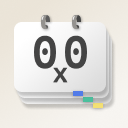
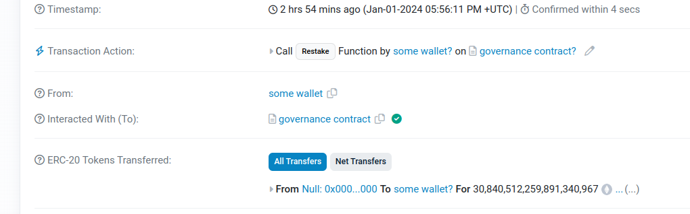

<h1>
  <!-- rolod0x -->
  
</h1>
<h2> Your free, private web3 addressbook </h2>

 

## Table of Contents

- [Intro](#intro)
- [Features](#features)
- [Why is it called rolod0x?](#name)
- [Why does web3 need private address books?](#why)
  - [But what's wrong with existing name services?](#name-services)
- [Donations](#donations)
- [Installation](#installation)
  - [Download](#download)
  - [Chrome](#chrome)
  - [Firefox](#firefox)
- [Usage](#usage)
- [Support](#support)
- [Development](#development)
- [Star History](#star-history)
- [Thanks](#thanks)
- [Security](#security)
- [Privacy](#privacy)
- [License](#license)

## Intro 

Would you buy a phone which didn't have an address book feature?  Of course
not - that would be ridiculous!  You'd never know who was calling you, and
making phone calls would be painful.

What about a phone which had an address book but required you to publish all
the entries so that the whole world could see them?  Of course not - that
would be a massive privacy violation!

**So why accept anything less when using web3 and blockchains?**

Well, you don't have to any longer!  rolod0x is a free cross-browser
extension providing **a totally private web3 address book which instantly
makes every web3 website more usable and all your addresses more
accessible.**

For example, take:
[this randomly-picked transaction on etherscan][random-tx]:

After labelling the From and To addresses in rolod0x, it now looks like this:

Not only that, but whenever these addresses appear on *any other website*,
they will now be labelled in this human-readable way!

[random-tx]: https://etherscan.io/tx/0x1e2a4312f7d48efd29ed5dbcca6cabae30214ea895ab54c9b789860cbe8d31dd

## Features 

- [Completely free and Open Source!](#license).
- Completely private local-only web3 address book.
- Automatically translates blockchain addresses to human-readable labels.
- Works on any website.
- Works on any EVM-based blockchain (and could easily support other
  chains in the future).
- Should work on Chrome, Chromium, Brave, or any other browser in the Chrome family.
- *May* work on Firefox - not yet tested, but planned (see https://github.com/aspiers/rolod0x/issues/19).

## Why is it called rolod0x? 

It's a combination of three ideas:

- A [rolodex](https://en.wikipedia.org/wiki/Rolodex) is a rotating
  file device which used to be a common way to store business contact
  information before the digital era.

- The word
  "[dox](https://www.urbandictionary.com/define.php?term=dox)" or
  "[d0x](https://www.urbandictionary.com/define.php?term=d0x)" refers
  to (revealing of) personal information about people online.

- `0x` is [a prefix used to denote hexadecimal numbers][0x],
  and in particular it's used as a prefix for all Ethereum addresses.

[0x]: https://stackoverflow.com/questions/2670639/why-are-hexadecimal-numbers-prefixed-with-0x

## Why does web3 need private address books? 

Many websites in web3 use long undecipherable blockchain addresses like
`0x6B175474E89094C44Da98b954EedeAC495271d0F` to refer to wallet accounts or
smart contracts.  This often creates a miserable experience for users, since
they have to pick one of two unsatisfactory options:

1. attempt to memorise these addresses, which is totally impractical, and
   also dangerous since it leaves users vulnerable to phishing attacks, or

2. rely on some kind of public or centralised name service.

### But what's wrong with existing name services? 

Name services in web3 typically come in two forms:

1. Public name services, most notably [ENS](https://ens.domains/).
   ENS is an awesome service for labelling *public* addresses, but
   it does not work as a *private* address book since all ENS
   domains are public to the whole world.  Furthermore:

   - It costs gas every time you want to set up a domain.

   - In many cases, websites display raw addresses even when there
     is a corresponding ENS entry.

2. Per-site hosted address books

   For example, <https://etherscan.io> has a "Address Private Name Tags"
   feature so that when you create an account and log in, you can register
   private name tags for any addresses you want.  Then whenever the site
   would have previously displayed the raw addresses, it will instead
   display the private name tags you submitted.

   This feature is also available on similar block explorers such as
   <https://polygonscan.com>.  However, it has several drawbacks:

   - It requires you to set up a separate address book for each block
     explorer you use.

   - Even if you do that, it only works on the block explorer site(s), not
     on any other web3 dApps you might use.

   - These services typically place limits on the amount of data you can
     submit.  For example, Etherscan limits private name tags to 35
     characters, and doesn't let you register more than 5000 addresses.

   - It requires you to trust the centralized block explorer services with
     your private addresses.  This is in direct opposition to the web3
     values of trust minimization and decentralization!

## Donations 

If you find this project helpful and would like to support its
development, you can make a donation using the following
cryptocurrency addresses:

- Send **Bitcoin** to: `bc1quuspvrjepx63k5hpydwqkf6nmtt9eqm86y8w8a`

- Send **ETH** / tokens on any Ethereum network to: `rolod0x.eth` (N.B. that's a zero before the `x`, not an uppercase `O` -- the address should resolve to `0x06357397d8078C19195f4555db7A407b1b1f5FB3`)

Your contribution will go directly towards enhancing the project, covering development costs, and supporting ongoing maintenance.

We appreciate every donation, no matter the size.  It helps to ensure the project's sustainability and motivates us to continue delivering valuable updates and improvements.

Thank you for considering a donation to support our work!

## Installation 

### Download 

In the (hopefully near) future, rolod0x will be available from the Chrome
Web Store (for which you can track progress in [#14][]) and Firefox Add-ons
directory (see [#19][] and [#15][]).  This will greatly simplify installation.

[#14]: https://github.com/aspiers/rolod0x/issues/14
[#15]: https://github.com/aspiers/rolod0x/issues/15
[#19]: https://github.com/aspiers/rolod0x/issues/19

However for now, you can download a `.zip` file from one of two places:

1. Go to [the releases page][releases], pick a recent release, and then look
   for an asset named something like `rolod0x-v0.1.0.zip` at the Assets
   section at the bottom of the release page.

2. Go to the [zip workflow][] page, and pick a build of a PR or branch such
   as `main`.  In this case you will need to download an artifact called
   `rolod0x.zip`.

[releases]: https://github.com/aspiers/rolod0x/releases
[zip workflow]: https://github.com/aspiers/rolod0x/actions/workflows/build-zip.yml

Then unpack the `.zip` file into a fresh folder anywhere on your machine,
remembering the location.

Then follow the relevant installation steps below for your browser:

### Installing in Chrome 

This should also work for other browsers in the Chrome family, such as
Chromium and Brave.

1. Open `chrome://extensions` in your browser.
2. Enable `Developer mode` at the top right.
3. Click `Load unpacked` at the top left.
4. Select the folder you just unpacked.

### Upgrading an existing installation in Chrome

Obviously you can uninstall the existing installation and do a fresh
install, but that may lose all your config.  So the following is probably
better:

1. Download and unpack the new version in exactly the same place.
2. Open `chrome://extensions` in your browser.
3. Click the reload icon near the bottom right of the rolod0x extension
   card.

### Installing in Firefox: 

**N.B. Firefox support has not been tested yet!**  However it is
planned - see <https://github.com/aspiers/rolod0x/issues/19>.

1. Open `about:debugging#/runtime/this-firefox` in your browser.
2. Click `Load Temporary Add-on...`.
3. Select `manifest.json` from the folder you just unpacked.

**Please note that in Firefox when you add plugin in temporary mode, that
means it will disappear after closing the browser, so you have to do it
again on next launch.**

## Usage 

> N.B. The following instructions are for browsers in the Chrome family.
> Other browsers such as Firefox will have similar usage, but these
> instructions will need to be augmented accordingly when they are
> officially supported.

### Usage in Chrome

- Once the extension is installed, it is recommended to pin it to the
  toolbar.  This can done either from <chrome://extensions>, or by clicking
  the jigsaw icon, finding the extension in the list, and then clicking the
  pin icon.

- On install, the extension's options page will automatically open,
  but you can re-open it later in the normal way, e.g. by clicking on
  the extension icon if it's pinned, or from <chrome://extensions>, or
  again via the jigsaw icon and then clicking the icon with the three
  vertical dots to the right of the extension.

- From the options page, add some addresses to your address book as
  directed by the help text.

- Click the `Save` button.

- Visit a web page where those addresses are displayed.

- You will now need to make sure that rolod0x is enabled for that website.
  If you have pinned the extension to the toolbar, you can right-click the
  extension icon and make sure that `Enable rolod0x on this domain` is
  selected.  Otherwise, you can reach the same context menu by clicking the
  three dots icon mentioned above.

- At this point, you should see that the addresses on the web page have been
  replaced with the labels you provided in the extension options.  If not,
  try simply reloading the web page.

## Support 

Please see [`CONTRIBUTING.md`](./CONTRIBUTING.md).

## Development and building from source 

For how to get started with development, see [the developer
guide](docs/dev-guide.md).

## Star History 

## Thanks 

Thanks to all contributors.  Some special mentions:

- [`@fregante`](https://github.com/fregante/) for all his great npm modules,
  several of which are used by rolod0x.

- [`@jonghakseo`](https://github.com/Jonghakseo/) for
  <https://github.com/Jonghakseo/chrome-extension-boilerplate-react-vite> which was
  a great starting point for a React-based MV3 extension.

- The awesome team at my startup [Toucan](https://toucan.earth) for being
  early beta testers and encouraging me to keep working on this project.

## Security 

Please see [the `SECURITY.md` file](./SECURITY.md).

## Privacy policy 

Please see [the `privacy-policy.md` file](./privacy-policy.md).

## License 

Except where otherwise stated, this extension is licensed under the GNU
General Public License v3 or later.  See [`LICENSE.txt`](./LICENSE.txt) for
details.

This [Free Software license][free software] was chosen because its
[copyleft][] property ensures that rolod0x remains a public good whereby:

- the whole community benefits indefinitely from any contributions, and

- it's protected against commercial entities who could otherwise profit from
  the code without requiring any contributions back to the original project.

[free software]: https://www.gnu.org/philosophy/free-sw.html
[copyleft]: https://www.gnu.org/philosophy/free-sw.html#copyleft

### Why is there also a `LICENSE` file including the Expat ("MIT") license?

This extension is based on
<https://github.com/Jonghakseo/chrome-extension-boilerplate-react-vite/>
[released][boilerplate-license] under [the permissive Expat (a.k.a. MIT)
license][expat], and formerly on
<https://github.com/fregante/browser-extension-template/> which is [released
under CC0][fregante-license].

Relicensing to GPL is allowed because the permissive Expat license
explicitly allows sublicensing as long as [the original copyright
notice](./LICENSE) is preserved.

[boilerplate-license]: https://github.com/Jonghakseo/chrome-extension-boilerplate-react-vite/blob/6b61cd12eeb2fe478a6fd290b63fb6a9ef0f9ff2/LICENSE
[fregante-license]: https://github.com/fregante/browser-extension-template/#license
[expat]: https://www.gnu.org/licenses/license-list.html#Expat
