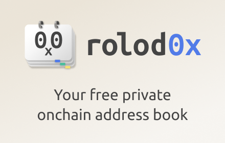

<h1>
  <!-- rolod0x -->
  
</h1>

 

  <a href="#overview">Overview</a> •
  <a href="#features">Features</a> •
  <a href="./docs/install.md">Installation</a> •
  <a href="./docs/user-manual.md">Usage</a> •
  <a href="./docs/FAQ.md">FAQ</a> •
  <a href="#donations">Donations</a> •
  <a href="./CONTRIBUTING.md">Support</a> •
  <a href="./docs/dev-guide.md">Development</a> •
  <a href="#star-history">Star History</a> •
  <a href="#thanks">Thanks</a> •
  <a href="./SECURITY.md">Security</a> •
  <a href="./docs/privacy-policy.md">Privacy</a> •
  <a href="#license">License

## Overview 

Would you buy a phone which didn't have an address book feature?  Of course
not - that would be ridiculous!  You'd never know who was calling you, and
making phone calls would be painful.

What about a phone which had an address book but required you to publish all
the entries so that the whole world could see them?  Of course not - that
would be a massive privacy violation!

**So why accept anything less when using web3 and blockchains?**

Well, you don't have to any longer!  rolod0x is a free cross-browser
extension providing **a totally private web3 address book which instantly
makes every web3 website more usable and all your addresses more
accessible.**

For example, take:
[this randomly-picked transaction on etherscan][random-tx]:

After labelling the From and To addresses in rolod0x, it now looks like this:

Not only that, but whenever these addresses appear on _any other website_,
they will now be labelled in this human-readable way!

[random-tx]: https://etherscan.io/tx/0x1e2a4312f7d48efd29ed5dbcca6cabae30214ea895ab54c9b789860cbe8d31dd

## Features 

- [Completely free and Open Source!](#license).
- Completely private local-only web3 address book.
- Automatically translates blockchain addresses to human-readable labels.
- Add entries directly from within a web page, by right-clicking on an address.
- Instantly look up an address via a hotkey.
- Works on any website.
- Works on any EVM-based blockchain (and could easily support other
  chains in the future).
- Should work on Chrome, Chromium, Brave, or any other browser in the Chrome family.
- _May_ work on Firefox - not yet tested, but planned (see https://github.com/aspiers/rolod0x/issues/19).
- [Command-line version](./docs/user-manual.md#cli) for translating addresses output on the terminal.
- Light and dark themes.
- Named using [a triple pun](./docs/FAQ.md#name).

## Installation 

Please see [the installation guide](./docs/install.md).

## Usage 

Please see [the user manual](./docs/user-manual.md).

## FAQ 

Please see [the Frequently Asked Questions page](./docs/FAQ.md).

## Donations 

If you find this project helpful and would like to support its
development, you can make a donation using the following
cryptocurrency addresses:

- Send **Bitcoin** to: `bc1quuspvrjepx63k5hpydwqkf6nmtt9eqm86y8w8a`

- Send **ETH** / tokens on any Ethereum network to: `rolod0x.eth`
  (N.B. that's a zero before the `x`, not an uppercase `O` -- the
  address should resolve to `0x06357397d8078C19195f4555db7A407b1b1f5FB3`)

Your contribution will go directly towards enhancing the project,
covering development costs, and supporting ongoing maintenance.

We appreciate every donation, no matter the size.  It helps to ensure
the project's sustainability and motivates us to continue delivering
valuable updates and improvements.

Thank you for considering a donation to support our work!

## Support 

Please see [this document](./CONTRIBUTING.md).

## Development and building from source 

For information on how to get started with development, please see
the [developer guide][].

Any [pull request][using PRs] providing an enhancement or bugfix is
extremely welcome!

[developer guide]: docs/dev-guide.md
[using PRs]: https://help.github.com/articles/using-pull-requests/

## Star History 

## Thanks 

Thanks to all contributors.  Some special mentions:

- [`@fregante`](https://github.com/fregante/) for all his great npm modules,
  several of which are used by rolod0x.

- [`@jonghakseo`](https://github.com/Jonghakseo/) for
  <https://github.com/Jonghakseo/chrome-extension-boilerplate-react-vite> which was
  a great starting point for a React-based MV3 extension.

- The awesome team at my startup [Toucan](https://toucan.earth) for
  being early beta testers and encouraging me to keep working on this
  project.  In particular, thanks to [Alex Haase](https://twitter.com/herrhaase)
  for brainstorming with me and coming up with the perfect name!

## Security 

Please see [the `SECURITY.md` file](./SECURITY.md).

## Privacy policy 

Please see [`docs/privacy-policy.md` file](./docs/privacy-policy.md).

## License 

Except where otherwise stated, this extension is licensed under the GNU
General Public License v3 or later.  See [`LICENSE.txt`](./LICENSE.txt) for
details.

This [Free Software license][free software] was chosen because its
[copyleft][] property ensures that rolod0x remains a public good whereby:

- the whole community benefits indefinitely from any contributions, and

- it's protected against commercial entities who could otherwise profit from
  the code without requiring any contributions back to the original project.

[free software]: https://www.gnu.org/philosophy/free-sw.html
[copyleft]: https://www.gnu.org/philosophy/free-sw.html#copyleft

### Why is there also a `LICENSE` file including the Expat ("MIT") license?

This extension is based on
<https://github.com/Jonghakseo/chrome-extension-boilerplate-react-vite/>
[released][boilerplate-license] under [the permissive Expat (a.k.a. MIT)
license][expat], and formerly on
<https://github.com/fregante/browser-extension-template/> which is [released
under CC0][fregante-license].

Relicensing to GPL is allowed because the permissive Expat license
explicitly allows sublicensing as long as [the original copyright
notice](./LICENSE) is preserved.

[boilerplate-license]: https://github.com/Jonghakseo/chrome-extension-boilerplate-react-vite/blob/6b61cd12eeb2fe478a6fd290b63fb6a9ef0f9ff2/LICENSE
[fregante-license]: https://github.com/fregante/browser-extension-template/#license
[expat]: https://www.gnu.org/licenses/license-list.html#Expat
