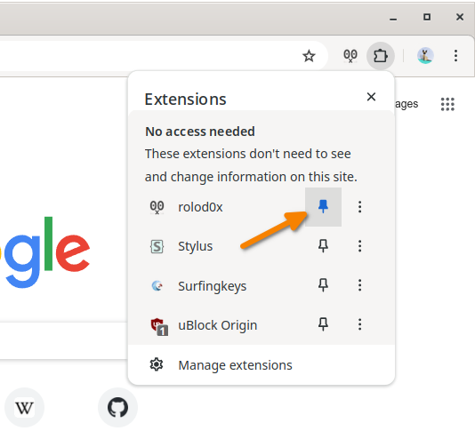
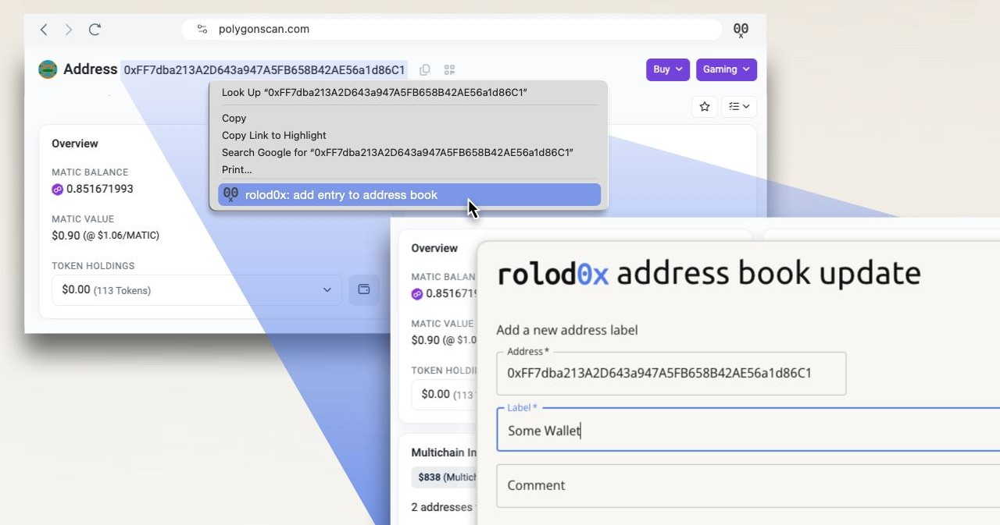
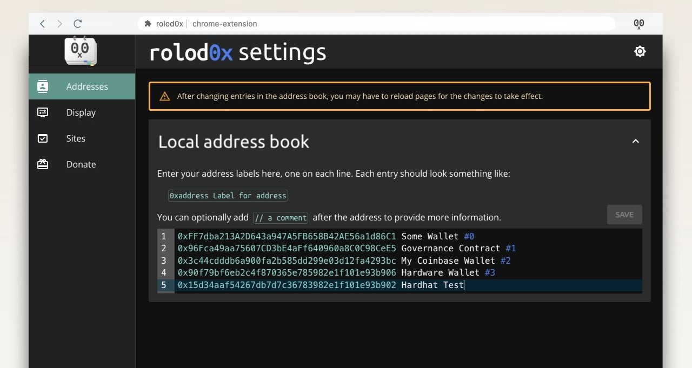
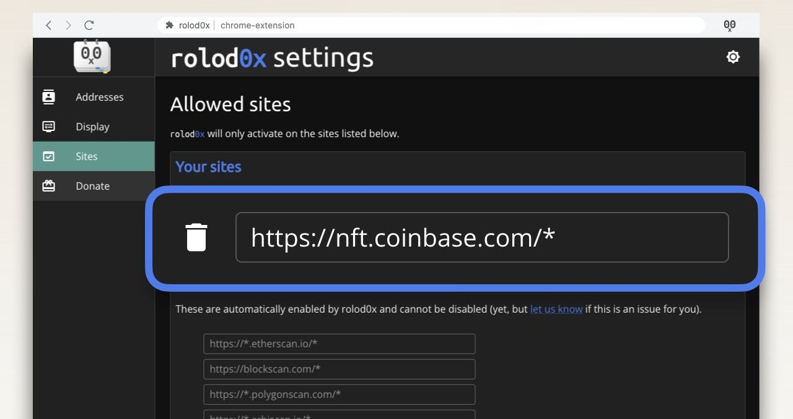
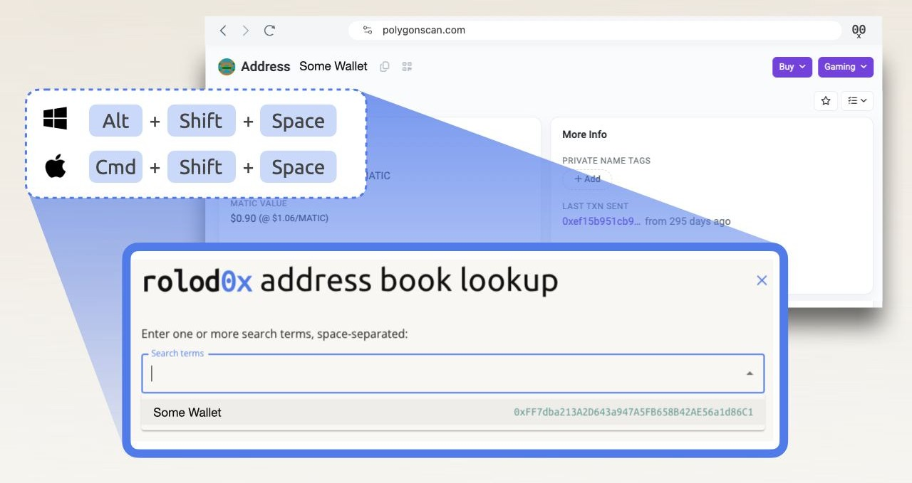
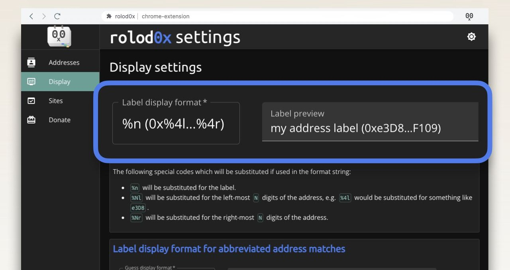

# User manual

- [Usage in Chrome and similar](#chrome)
- [Usage in other browsers](#other)
- [Usage on the command line](#cli)
- [Importing token lists on the command line](#import-tokenlist)

## Usage in Chrome and similar <a name="chrome"></a>

The following instructions are for Chrome and other browsers in the
Chrome family, such as Chromium and Brave.

### First steps after install

Once the extension is installed, it is recommended to pin it to the
toolbar.  This can done either from <chrome://extensions>, or by
clicking the jigsaw icon, finding the extension in the list, and then
clicking the pin icon.



On install, the extension's options page will automatically open,
but you can re-open it later in the normal way, e.g. by clicking on
the extension icon if it's pinned, or from <chrome://extensions>, or
again via the jigsaw icon and then clicking the icon with the three
vertical dots to the right of the extension.

### Adding labels to the address book

There are two ways to do label an address.  The easiest is simply to
right-click on it, and then select the rolod0x option from the context
menu:

[](./images/right-click.jpg)

Currently this only works if rolod0x is enabled on that website (see
the [the section below on controlling which sites are
allowed](#allow-list)).  However [a fix for this is
planned](https://github.com/rolod0x/rolod0x/issues/216), so in future
right-click will work on any site.

After adding the label, you should see the address you right-clicked
on immediately replaced with the label.  To ensure that this happens
for this website in the future, you will also need to make sure that
rolod0x is enabled for that site, unless it's one of the built-in
sites listed under the "Sites" section of the settings.  See [the
below section](#allow-list) for how to do that.

The second way to add addresses is from the options page:

[](./images/edit-as-text.jpg)

1.  Add some addresses to your address book as directed by the help text.

2.  Click the `Save` button.

3.  Visit a web page where those addresses are displayed.

4.  You will now need to make sure that rolod0x is enabled for that
    website, unless it's one of the built-in sites listed under the
    "Sites" section of the settings.  See [the below
    section](#allow-list) for how to do that.

5.  At this point, you should see that the addresses on the web page
    have been replaced with the labels you provided in the extension
    options.  If not, try simply reloading the web page.

### Handling of duplicate labels

Note that if you enter the same address multiple times with different
labels, when replacing labels with addresses, rolod0x will
automatically join the labels together with a `/` character in between
each label.  The same applies for comments.

### Controlling which sites rolod0x is active on <a name="allow-list"></a>

By default, rolod0x is enabled and will substitute known addresses for
labels on a bunch of well-known block explorers and other sites.  However
you can manually enable it on other sites as follows:

If you have pinned the extension to the toolbar, you can right-click
the extension icon and make sure that `Enable rolod0x on this domain`
is selected.  Otherwise, you can reach the same context menu by
clicking the three dots icon mentioned above.

You can view and control the list of enabled sites in the `Sites`
section of the options page:

[](./images/enable-per-site.jpg)

At this time it is not possible to disable rolod0x on the built-in
sites, however if you need that functionality, please upvote [issue
#215](https://github.com/rolod0x/rolod0x/issues/215).

There is also [issue
#74](https://github.com/rolod0x/rolod0x/issues/74) which is an idea
for a future feature to allow temporarily disabling of rolod0x for the
current tab.

### Looking up an address

If you want to quickly obtain an address, you can click the extension
icon and select the `Search` menu item.

Alternatively you can press a keyboard shortcut to launch a popup
window to do a lookup.  By default, this hotkey is
`Shift`-`Alt`-`Space` on Windows and Linux, and
`Shift`-`Command`-`Space` on MacOS, but you can customize this by
visiting <chrome://extensions/> and then clicking on `Keyboard
shortcuts`.

[](./images/hotkey-lookup.jpg)

This hotkey should work on any regular website, even ones on which
rolod0x has not yet been enabled.  However it will not work on
"special" pages, such as browser settings pages or local files (even
if `Allow access to file URLs` is enabled).  Unfortunately this is a
browser limitation which probably can't be bypassed.

If it's not working on normal pages, then visit
<chrome://extensions/shortcuts> and make sure that you have the hotkey
set up correctly.

### Customizing the label display format

See the `Display` section of the options page which explains this in
detail.

[](./images/customize-display-format.jpg)

## Usage in other browsers <a name="other"></a>

**N.B. Firefox support has not been tested yet!**  However it is
planned - see <https://github.com/rolod0x/rolod0x/issues/19>.

Other browsers such as Firefox will have similar usage, but these
instructions will need to be augmented accordingly when they are
officially supported.

## Usage on the command line <a name="cli"></a>

If [installation](./install.md#cli) was successful then you should be
able to run the `rolod0x` command.  If not, then try to `cd` to the
source directory and run:

    pnpm --silent run rolod0x

The CLI utility takes an address book text file as a parameter, and
then reads input from `STDIN` and filters it through rolod0x's
replacement engine, so that `STDOUT` will contain the same text with
any recognised addresses substituted for a labelled version.

The substitution format can be controlled similarly as in the browser
extension.

If you use this regularly with a preferred address book file and/or
display formats, you can create a simple wrapper shell script
somewhere on your `$PATH`, containing something like the following:

    ```sh
    #!/bin/sh

    cd ~/path/to/rolod0x
    pnpm --silent run rolod0x ~/path/to/my-address-book.txt "$@"
    ```

For example, this could be called `rx` for easy invocation.
Don't forget to make it executable:

    chmod +x rx

If you're lucky / smart enough to be using
[`zsh`](https://zsh.sourceforge.io/) instead of `bash`, you could even
create a global alias:

    alias -g 0x='|& rx'

Then you can just append ` 0x` to the end of any command and it will
pipe STDOUT and STDERR through rolod0x.

### Listing duplicate labels

If you specify the `-d` or `--duplicates` option, then instead of
filtering `STDIN`, it will list all addresses in the given address
book file which have duplicate labels.

## Importing token lists on the command line <a name="import-tokenlist"></a>

If you want to augment your private address book with some well-known
public addresses, take a look at https://tokenlists.org/ has a nice
list of public token lists.

You can of course copy any of these into your address book manually,
but you can also convert a whole list into rolod0x, by downloading the
source JSON file, and then running something like the following:

    pnpm --silent tokenlist:import tokens.json > tokens.txt

The contents of the resulting `tokens.txt` file can then be imported
into rolod0x simply by pasting them into the address book.
